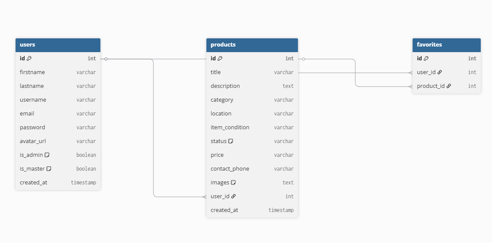

# EcoShare

## Linkit

* **Sovellus:** [linkki](https://eco-share-kohl.vercel.app/)
* **Back-end API:** [linkki](https://ecoshare-backend.onrender.com/)

## Testikäyttäjien tunnukset

**1. Admin käyttäjä:**
* Säh: admin@gmail.com
* Sal: salasana123

**2. Korjaaja käyttäjä:**
* Säh: master@gmail.com
* Sal: salasana123

**3. Normaali käyttäjä:**
* Säh: test@gmail.com
* Sal: salasana123

## Toteutetut toiminnallisuudet

* **Käyttäjähallinta ja autentikaatio:** Rekisteröityminen, sisäänkirjautuminen ja uloskirjautuminen.
* **Käyttäjäroolit:** *
  * *Normaali käyttäjä:* Voi luoda, muokata ja poistaa omia ilmoituksiaan sekä lisätä muiden tuotteita suosikkeihin.
  * *Korjaaja:* Ainoa joka näkee "Kaipaa korjausta" statuksella olevat ilmoitukset.
  * *Admin:* Pääsy hallintapaneeliin, jossa voi jakaa Master-oikeuksia, muokata ilmoitusten otsikoita ja poistaa asiatonta sisältöä.
* **Tiedostojen lataus:** Käyttäjät voivat ladata tuotekuvia ja profiilikuvia.
* **Suosikkijärjestelmä:** Käyttäjät voivat tallentaa kiinnostavia ilmoituksia omaan profiiliinsa.
* **Hakutoiminnot:** Reaaliaikainen tekstihaku ja kategorisointi.
* **Responsiivisuus:** Käyttöliittymä mukautuu täysin mobiililaitteille ja se on PWA.

## Tietokannan rakenne

Sovellus käyttää MySQL, joka on isännöity Clever Cloudissa.

**Päätaulut:**
1. `users`: Tallentaa käyttäjätiedot. Sisältää boolean-kentät `is_admin` ja `is_master` roolien hallintaa varten.
2. `products`: Tallentaa ilmoitukset. Sisältää vierasavaimen `user_id`, joka viittaa ilmoituksen jättäjään (ON DELETE CASCADE).
3. `favorites`: Välitaulu, joka yhdistää `users.id` ja `products.id` monesta-moneen -suhteella.

**Tietokantakaavio:**

## API-dokumentaatio

| Metodi | Reitti | Kuvaus |
|---|---|---|
| POST | `/api/register` | Luo uuden käyttäjätilin |
| POST | `/api/login` | Kirjaa käyttäjän sisään ja palauttaa JWT-tokenin |
| POST | `/api/users/avatar/:id` | Päivittää käyttäjän profiilikuvan |
| GET | `/api/products` | Hakee kaikki julkiset ilmoitukset |
| GET | `/api/products/user/:id` | Hakee tietyn käyttäjän omat ilmoitukset |
| POST | `/api/products` | Luo uuden ilmoituksen |
| PUT | `/api/products/:id` | Päivittää ilmoituksen tietoja |
| DELETE | `/api/products/:id` | Poistaa ilmoituksen |
| POST | `/api/favorites/toggle` | Lisää tai poistaa tuotteen suosikeista |
| GET | `/api/admin/users` | Hakee listan kaikista käyttäjistä |
| PUT | `/api/admin/users/:id/master`| Antaa tai poistaa Master-roolin |

## Ohjelmistotestaus

* **Testitiedostojen sijainti:** [linkki](https://github.com/deni-isr/ecoShare_backend/blob/main/api.test.js)
* Testit voi ajaa lokaalisti komennolla: `npm run test`

## Käytetyt teknologiat ja referenssit

**Teknologiat:**
* Front-end: React, TypeScript, Vite, Tailwind CSS, React Router
* Back-end: Node.js, Express.js
* Tietokanta: MySQL
* Hosting: Front-end: Vercel , Back-end: Render

## Bugit ja ongelmat

* Ilmaisen pilvipalvelimen vuoksi back-end saattaa mennä nukkumaan. Tämän vuoksi sovelluksen ensimmäinen lataus voi kestää 15-30 sekuntia.
* Uloskirjautumisen yhteydessä navbar jättää näkyviin kirjautuneen käyttäjän painikkeita. Ongelma poistuu päivittämällä sivu selaimessa.
* Kuvien lataus, sekä ios että android laitteilla kuvien lisääminen ilmoitukseen edellyttää, että käyttäjä myöntää selaimelle käyttöoikeuden laitteen kuvagalleriaan.

## Kuvakaappaukset käyttöliittymästä

